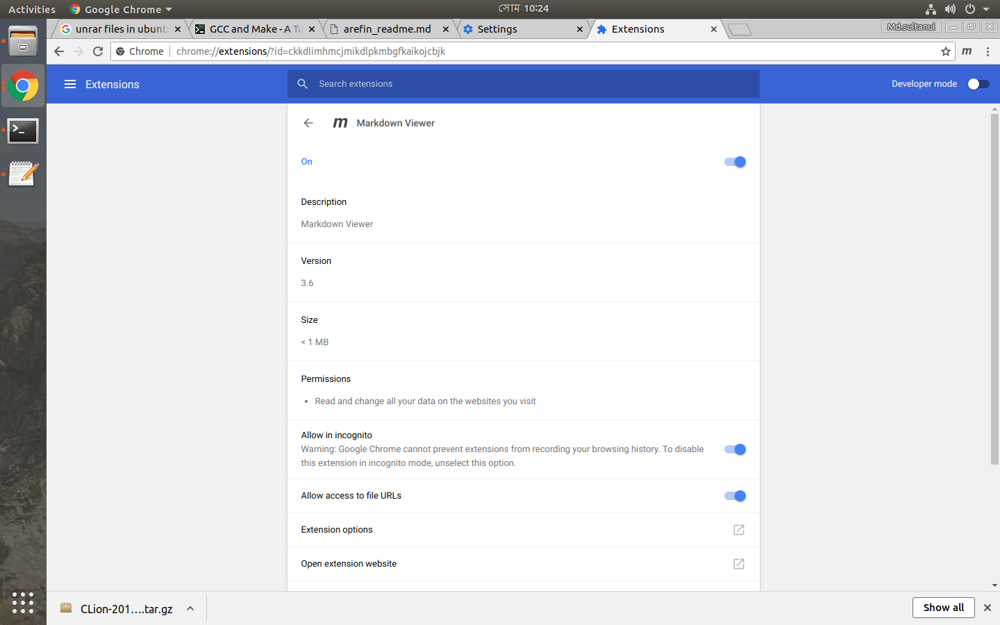

# Arefin GCC example

 

## hellofunc.c contains main method.

## Instructions --> 

	./august_27$ touch hello.c

	./august_27$ gcc hello.c

	./august_27$ ./a.out

Hello, world!

Previous output was a.out now it is "hello.exe".

	g++ -o hello.exe hello.cpp

 ./hello.exe
Hello, world!

	

