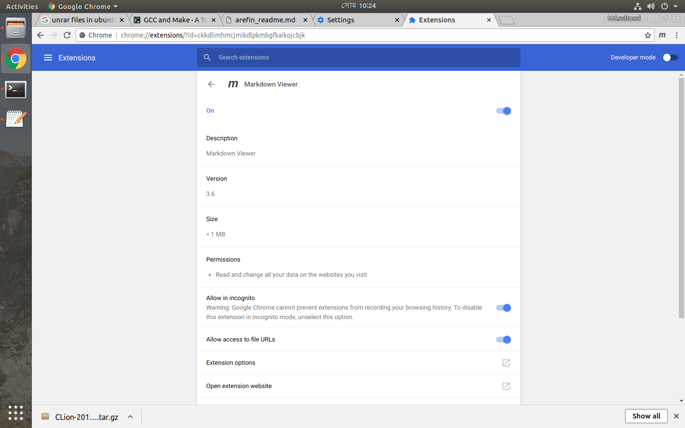

# Arefin GCC example

 

## hellofunc.c contains main method.

## Instructions --> 

	arefin@arefin-G41MT-S2P:/mnt/1840d0d8-5a6c-4dc3-bff6-88237bf5657b/arefin/arefin_crossover_task_unix/linuxunix/makeFile/august_27$ touch hello.c

	arefin@arefin-G41MT-S2P:/mnt/1840d0d8-5a6c-4dc3-bff6-88237bf5657b/arefin/arefin_crossover_task_unix/linuxunix/makeFile/august_27$ gcc hello.c

	arefin@arefin-G41MT-S2P:/mnt/1840d0d8-5a6c-4dc3-bff6-88237bf5657b/arefin/arefin_crossover_task_unix/linuxunix/makeFile/august_27$ ./a.out
Hello, world!

	arefin@arefin-G41MT-S2P:/mnt/1840d0d8-5a6c-4dc3-bff6-88237bf5657b/arefin/arefin_crossover_task_unix/linuxunix/makeFile/august_27$ 

